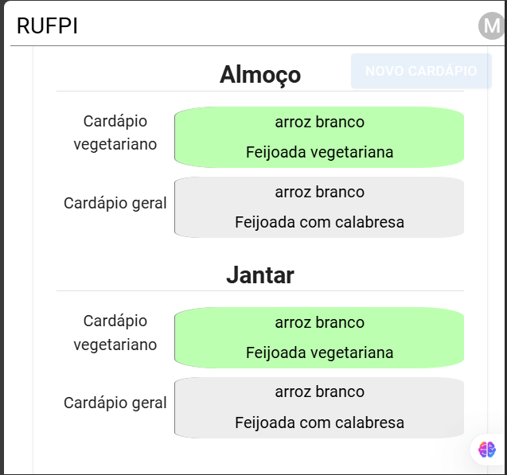

# RUFPI - Frontent: React + vite + Typescript

Sistema responsivo para que possa ser utilizado em dispositivos moveis, computadores e televisores. Este sistema está vinculado a outros dois sistemas e tem o objetivo conectar funcionários e discentes através da interação entre estes nos cardápios diários feitos no Restaurante Universtário (RU) da Universidade Federal do Piauí (UFPI).

## Aplicação

Desenvolvida pensando em dispositivos que suportem layout de 450px ou mais de largura (Smartphones, computadores e televisores). Ou seja, a aplicação não é responsiva para todos os dispositivos, uma vez que está aplicaçãoé um protótipo para que possa de fato ser desenvolvida em sua completude.

O layout da aplicação é simples levando em consideração ao atual site da UFPI. Os usuários devem se cadastrar para que possam ter aceso à aplicaçaão.

### Tecnologias utilizadas

A aplicação foi desenvolvida no VSCode utilizando projeto React + vite + Typescript. Além disso, foi utilizado `pnpm` como o principal gerenciador de pacotes para a instalação de componentes durante a implementação do sistema, como a instalação dos compontentes do MaterialUI. Logo, para rodar a aplicação, é necessário ter o `pnpm` instalado na máquina.

### Execução

Primeiro é necessário que seja feito a instalaçao das dependências utilizando o comando `pnpm i` e em seguida `pnpm run dev` para a executar a aplicação em modo desenvolvedor.

### Funcionalidades

A aplicação, neste primeiro momento, é usada para:
- Comprovar que o discente está com cadastro válido sem precisar entrar no SIGAA;
- Gerenciar carteira digital de fichas do RU da universidade;
- Visualizar o cardápio do dia.
- Cadastrar Cardápios cujos ingredientes já são cadastrados no sistema (backend).

#### Permissões no sistema.

A aplicação contém 3 tipos de permissões: usuário administrativo, usuário comum e usuário com permissões de nutricionista. Este último, ainda não foi implementado neste primeiro momento.

#### Principais Telas

Dentre as principais telas estão:

1. Cadastro de usuário;
2. Login de usuário;
3. Inicio: onde terá os todos os cardápios;
4. Perfil de usuário: para o usuário poder gerenciar suas informações;
5. Criação de cardápios.

A criação de usuário é simples. Como tem dois tipos de usuários (administrativo e comum), o usuário terá de escolher qual tipo de usuário criar para depois poder preencher os campos. Dentre os principais campos, o email e senha serão necessários para entrar na aplicação.

 </img>

Iniciar sessão na plataforma RUFPI.

A tela inicial do usuário mostrará todos os cardápios cadastrados no sistema (na versão atual da aplicação) ordenados do mais recente ao mais antigo. Caso o usuário seja um administrador, irá aparecer o botão de cadastrar cardápio no canto superior direito da tela.

 </img>

Página inicial do usuário.

Além disso, o usuário pode usar o menu de usuário para sair da aplicação ou entrar no perfil de usuário.

No perfil de usuário, o usuário pode gerenciar algumas informações como nome, email, se ainda é nutricionista, senha e "compra" de fichas.

 </img>

Criação de um novo cardápio

Na página inicial, ao selecionar a funcionalidade de criar cardápio, irá aparecer uma janela para que o usuário preencha os campos para o cadastro de um cardápio de forma simples.

 </img>

Criação de um novo cardápio

> A aplicação é responsiva para dispositivos de até 450px de largura.